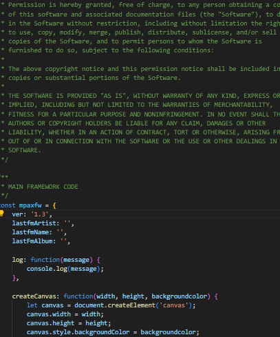
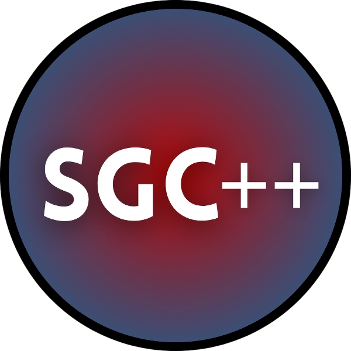

<h1>Hi! I'm mpax235!</h1>
I mainly program, make games, and more stuff like that!

<h3 align="left">Currently the languages I know are:</h3>

    
  <a align="center">I make:</a> 
   
  <a align="center">The ones I know a little bit are:</a> 
   
  <a align="center">The languages that I want to learn are:</a> 
    
  <a align="center">I also know Linux Shell language and Windows Batch language!</a>

  

