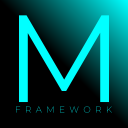

<h1>Hi! I'm mpax235!</h1>
I mainly program, make games, and more stuff like that!

<h3 align="left">Currently the languages I know are:</h3>

    
  <a align="center">The software I use:</a> 
   
  <a align="center">The ones I know a little bit are:</a> 
   
  <a align="center">The modules/frameworks/libraries that I use are:</a> 
    
  <a align="center">The languages/modules/frameworks/libraries that I want to learn are:</a> 
    
  <a align="center">I also know Linux Shell language and Windows Batch language!</a>

<table align="center">
  <tr>
    <td>
      
    </td>
    <td>
      
    </td>
  </tr>
</table>
